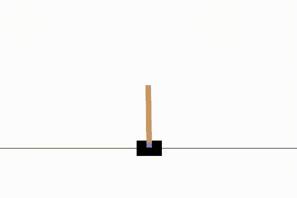

# Reinforecement-Learning

## Project Description

This project involves the development and evaluation of a Reinforcement Learning (RL) agent to solve the CartPole-v1 environment using Q-learning. The project is structured into several tasks, each contributing to the creation of an efficient and effective RL agent.



### Key Features:
- **Task 1: Development of an RL Agent**  
  - Constructing a Q-table and discretizing continuous state spaces.
  - Implementing functions for state-action selection, Q-table updates, and learning steps.
  
- **Task 2: Evaluating Agent Effectiveness**  
  - Training the agent over multiple epochs and assessing performance.
  - Visualizing learning progress and evaluating the agent's decision-making ability.

- **Task 3: Video Rendering**  
  - Capturing and rendering videos of the agent's performance to visualize how well it balances the pole.

### Technologies Used:
- Python
- Gym (OpenAI)
- TensorFlow
- Matplotlib

This project demonstrates the application of Q-learning, a fundamental RL algorithm, to a classic control problem. The approach includes detailed steps for discretizing continuous spaces, choosing actions using an epsilon-greedy policy, and updating the Q-table based on the agent's interactions with the environment.

This repository includes all necessary scripts to reproduce the results, as well as a video showcasing the agent's performance.


## Contributions

Jarel Tan Zhi Wen,Do Duc Anh, Lee Cheng Han

## Installing Packages
To run the code, you need to install the following packages:

```bash
!apt-get  install  -y  xvfb  python-opengl  >  /dev/null  2>&1
!pip  install  gym  pyvirtualdisplay  >  /dev/null  2>&1
!apt-get  install  -y  xvfb  python-opengl  ffmpeg  >  /dev/null  2>&1
!pip  install  gym[classic_control]
!apt-get  update  >  /dev/null  2>&1
!apt-get  install  cmake  >  /dev/null  2>&1
!pip  install  --upgrade  setuptools  >  /dev/null  2>&1
!pip  install  ez_setup  >  /dev/null  2>&1
```

## Importing Packages

Once the packages are installed, import the necessary libraries:

```python
import gym
from gym import logger as gymlogger
from gym.wrappers import RecordVideo
import tensorflow as tf
import numpy as np
import random
import matplotlib.pyplot as plt
import math
import glob
import io
```

Here's how you can structure the provided content into a README file format:

---

# Reinforcement Learning Agent for CartPole

## Contributions
- **Task 1 - 4**: Do Duc Anh, Jarel Tan Zhi Wen, Lee Cheng Han

## Installing Packages

To run the code, you need to install the following packages:

```bash
!apt-get install -y xvfb python-opengl > /dev/null 2>&1
!pip install gym pyvirtualdisplay > /dev/null 2>&1
!apt-get install -y xvfb python-opengl ffmpeg > /dev/null 2>&1
!pip install gym[classic_control]
!apt-get update > /dev/null 2>&1
!apt-get install cmake > /dev/null 2>&1
!pip install --upgrade setuptools > /dev/null 2>&1
!pip install ez_setup > /dev/null 2>&1
```

## Importing Packages

Once the packages are installed, import the necessary libraries:

```python
import gym
from gym import logger as gymlogger
from gym.wrappers import RecordVideo
import tensorflow as tf
import numpy as np
import random
import matplotlib.pyplot as plt
import math
import glob
import io
import base64
from IPython.display import HTML
from IPython import display as ipythondisplay

gymlogger.set_level(40) # error only
%matplotlib inline
```

## Loading CartPole Environment

```python
env = gym.make("CartPole-v1")
```

## Task 1: Development of an RL Agent

### Constructing Q-table and Bins

The Q-table is constructed by iteratively updating the expected value of each state-action pair based on the agent's experience in the environment.

```python
def create_q_table(n_size, state_space, action_space):
    bins = [
        np.linspace(-4.8, 4.8, n_size),
        np.linspace(-4, 4, n_size),
        np.linspace(-0.418, 0.418, n_size),
        np.linspace(-4, 4, n_size)
    ]
    q_table = np.random.uniform(low=-1, high=1, size=([n_size] * state_space + [action_space]))
    return bins, q_table

bins, q_table = create_q_table(20, 4, 2)
```

### Discretizing the Continuous Space

Discretizing continuous spaces involves dividing the infinite range of possible states into a finite set of discrete states.

```python
def discretizing_state(state, bins, state_space):
    return tuple(np.digitize(state[i], bins[i]) - 1 for i in range(state_space))

state = env.reset()
state = discretizing_state(state, bins, 4)
```

### Choosing Action to Perform

```python
def choose_action(env, q_table, state, epsilon):
    if np.random.uniform() < epsilon:
        return env.action_space.sample()
    else:
        return np.argmax(q_table[state])
```

### Updating Q-table

```python
def update_q_table(q_table, state, action, reward, next_state, alpha, gamma):
    td_error = reward + gamma * np.max(q_table[next_state]) - q_table[state][action]
    q_table[state][action] += alpha * td_error
    return td_error
```

### Learning Step and Sampling a Random State

```python
state = env.reset()
state = discretizing_state(state, bins, 4)
action = choose_action(env, q_table, state, 1.0)
next_state, reward, done, info = env.step(action)
next_state = discretizing_state(next_state, bins, 4)

print("Observation:")
print(q_table[state][action])
td_error = update_q_table(q_table, state, action, reward, next_state, 0.1, 0.995)
print(q_table[state][action])
print("Action:")
print(action)
```

## Task 2: Effectiveness of an RL Agent

### Learning and Evaluation Functions

```python
def learn(env, q_table, bins, epochs, blk_size, epsilon, alpha, epsilon_min, epsilon_decay, gamma):
    avg_log = []
    blk_sum = 0
    for epoch in range(epochs):
        state = env.reset()
        state = discretizing_state(state, bins, 4)
        score = 0
        done = False
        while not done:
            action = choose_action(env, q_table, state, epsilon)
            next_state, reward, done, _ = env.step(action)
            next_state = discretizing_state(next_state, bins, 4)
            update_q_table(q_table, state, action, reward, next_state, alpha, gamma)
            score += reward
            state = next_state
            if score >= 500:
                done = True
        epsilon = max(epsilon_min, epsilon * epsilon_decay)
        blk_sum += score

        if epoch % blk_size == blk_size-1:
            blk_mean = blk_sum / blk_size
            avg_log.append(blk_mean)
            print(f"Training Epoch {epoch+1}\t\t\t\tMean Score {blk_mean}")
            blk_sum = 0

    x_values = []
    for x in range(0, epochs, blk_size):
        x_values.append(x)
    plt.plot(x_values, avg_log)
    plt.xlabel("Epochs")
    plt.ylabel("Score")
    plt.title("Average Training Score")
    plt.show()

def predict(q_table, state):
    return np.argmax(q_table[state])

def evaluate(epochs, q_table, bins):
    scores = []
    for epoch in range(epochs):
        state = env.reset()
        state = discretizing_state(state, bins, 4)
        score = 0
        done = False

        while not done:
            action = predict(q_table, state)
            next_state, reward, done, _ = env.step(action)
            score += reward
            state = discretizing_state(next_state, bins, 4)
            scores.append(score)
            print(f"Testing Epoch {epoch + 1}\t\t\tScore {score}")

    plt.plot(scores)
    plt.xlabel("Test#")
    plt.ylabel("Score")
    plt.title("Testing Score")
    plt.show()
    return sum(scores) / len(scores)
```

### Running the Learning Algorithm

```python
learn(env, q_table, bins, 10000, 100, 1.0, 0.1, 0.01, 0.999, 0.995)
```

### Evaluating the RL Agent

```python
evaluate(100, q_table, bins)
```

## Task 3: Render Video

```python
def show_video():
    mp4list = glob.glob('video/*.mp4')
    if len(mp4list) > 0:
        mp4 = mp4list[0]
        video = io.open(mp4, 'r+b').read()
        encoded = base64.b64encode(video)
        ipythondisplay.display(HTML(data=''''''.format(encoded.decode('ascii'))))
    else:
        print("Could not find video")
```

---